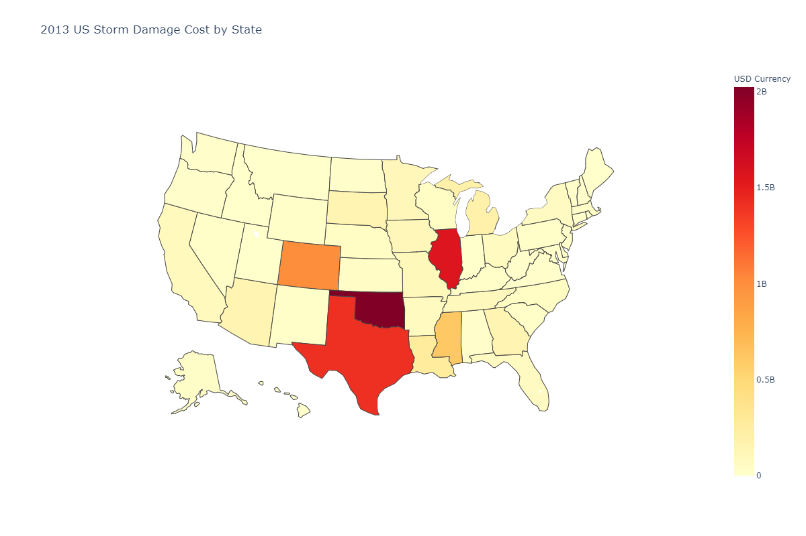
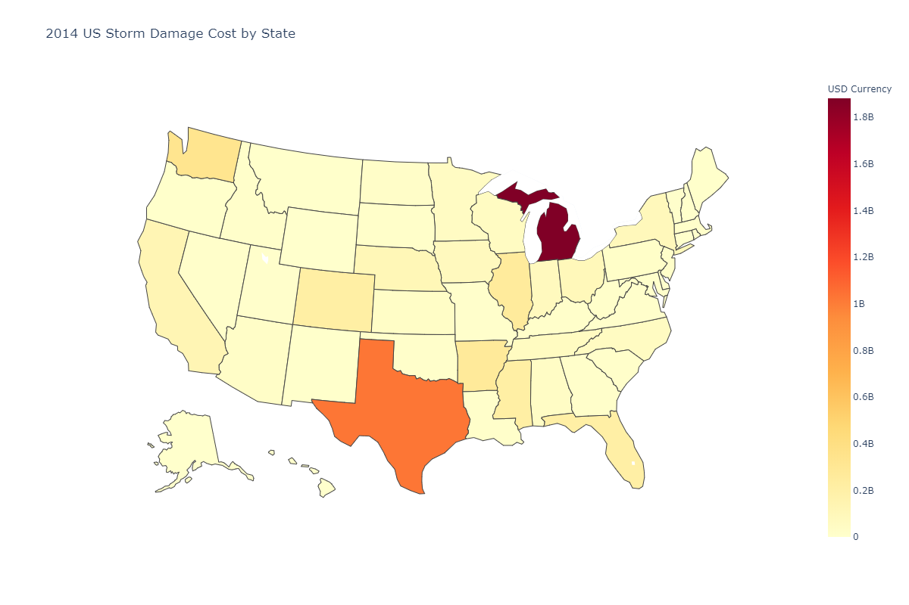
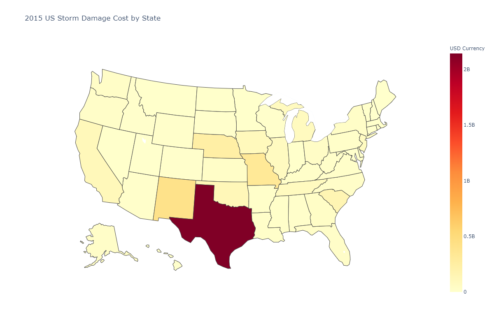
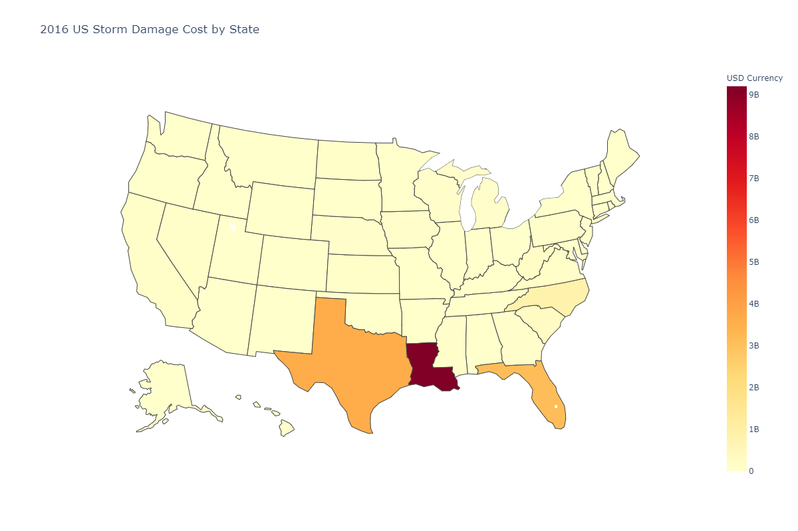
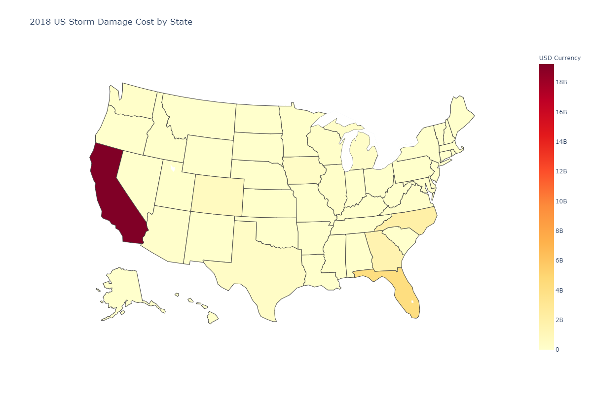
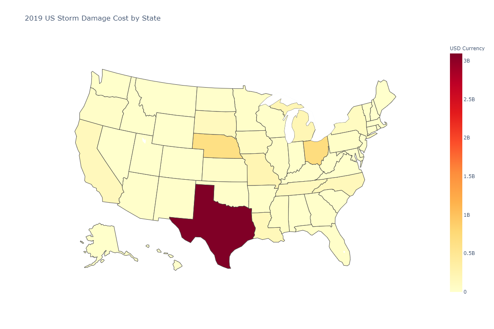

Weather damage data influences many things in our society from how much property insurance and reinsurance businesses set back for possible payouts to how the federal and local government advise people to prepare for possible disaster.

I took a look at the cost incurred by weather damage in the years 2013-2019 which excludes crop damage to see if I could find any of my own patterns. 

One of the patterns I noticed first was that after 2015 the cost of damage skyrocketed and didn’t come back down till 2019. In 2020 we have already seen major damage from tornadoes and flooding so I feel like it might turn out to be another high year possible like 2017 or 2018. With climate change intensifying storms I am very interested to see if the high cost of storm damage will continue.

<iframe width="900" height="800" frameborder="0" scrolling="no" src="//plot.ly/~Lmstephens/19.embed"></iframe>

Click on the tabs below to see more maps by year

<ul class="nav nav-tabs">
  <li><a href="#2013" data-toggle="tab">2013</a></li>
  <li><a href="#2014" data-toggle="tab">2014</a></li>
  <li><a href="#2015" data-toggle="tab">2015</a></li>
  <li><a href="#2016" data-toggle="tab">2016</a></li>
  <li><a href="#2017" data-toggle="tab">2017</a></li>
  <li><a href="#2018" data-toggle="tab">2018</a></li>
  <li><a href="#2019" data-toggle="tab">2019</a></li>
</ul>

	

		<a href="https://plot.ly/~Lmstephens/21/" target="_blank">Click to view interactive map</a>
		
	

	

		<a href="https://plot.ly/~Lmstephens/23/" target="_blank">Click to view interactive map</a>
		
	

	

		<a href="https://plot.ly/~Lmstephens/25/" target="_blank">Click to view interactive map</a>
		
	

	

		<a href="https://plot.ly/~Lmstephens/27/" target="_blank">Click to view interactive map</a>
		
	

	

		<a href="https://plot.ly/~Lmstephens/29/" target="_blank">Click to view interactive map</a>
		
	

	

		<a href="https://plot.ly/~Lmstephens/31/" target="_blank">Click to view interactive map</a>
		
	

	

		<a href="https://plot.ly/~Lmstephens/33/" target="_blank">Click to view interactive map</a>
		
	

<h2>2013</h2>
<table class="table">
  <thead class="thead-light">
    <tr>
      <th scope="col">#</th>
      <th scope="col">State</th>
      <th scope="col">Damage Property</th>
    </tr>
  </thead>
  <tbody>
    <tr>
      <th scope="row">1</th>
      <td>OK</td>
      <td>2023424300</td>
    </tr>
    <tr>
      <th scope="row">2</th>
      <td>IL</td>
      <td>1562382000/td>
    </tr>
    <tr>
      <th scope="row">3</th>
      <td>TX</td>
      <td>1410698000</td>
    </tr>
	<tr>
      <th scope="row">4</th>
      <td>CO</td>
      <td>1003891750</td>
    </tr>
	  <tr>
      <th scope="row">5</th>
      <td>MS</td>
      <td>609917000</td>
    </tr>
  </tbody>
</table>

<h2>2014</h2>
<table class="table">
  <thead class="thead-light">
    <tr>
      <th scope="col">#</th>
      <th scope="col">State</th>
      <th scope="col">Damage Property</th>
    </tr>
  </thead>
  <tbody>
    <tr>
      <th scope="row">1</th>
      <td>MI</td>
      <td>1881374000</td>
    </tr>
    <tr>
      <th scope="row">2</th>
      <td>TX</td>
      <td>1026154650</td>
    </tr>
    <tr>
      <th scope="row">3</th>
      <td>WA</td>
      <td>328164500</td>
    </tr>
    <tr>
      <th scope="row">4</th>
      <td>AR</td>
      <td>266334400</td>
    </tr>
    <tr>
      <th scope="row">5</th>
      <td>IL</td>
      <td>255703000</td>
    </tr>
  </tbody>
</table>

<h2>2015</h2>
<table class="table">
  <thead class="thead-light">
    <tr>
      <th scope="col">#</th>
      <th scope="col">State</th>
      <th scope="col">Damage Property</th>
    </tr>
  </thead>
  <tbody>
    <tr>
      <th scope="row">1</th>
      <td>TX</td>
      <td>2143740069</td>
    </tr>
    <tr>
      <th scope="row">2</th>
      <td>NM</td>
      <td>410924700</td>
    </tr>
    <tr>
      <th scope="row">3</th>
      <td>MO</td>
      <td>323680000</td>
    </tr>
    <tr>
      <th scope="row">4</th>
      <td>NE</td>
      <td>235079799</td>
    </tr>
    <tr>
      <th scope="row">5</th>
      <td>SC</td>
      <td>153771870</td>
    </tr>
  </tbody>
</table>

<h2>2016</h2>
<table class="table">
  <thead class="thead-light">
    <tr>
      <th scope="col">#</th>
      <th scope="col">State</th>
      <th scope="col">Damage Property</th>
    </tr>
  </thead>
  <tbody>
    <tr>
      <th scope="row">1</th>
      <td>LA</td>
      <td>9205589800</td>
    </tr>
    <tr>
      <th scope="row">2</th>
      <td>TX</td>
      <td>3610540800</td>
    </tr>
    <tr>
      <th scope="row">3</th>
      <td>FL</td>
      <td>3132700150</td>
    </tr>
    <tr>
      <th scope="row">4</th>
      <td>NC</td>
      <td>832141298</td>
    </tr>
    <tr>
      <th scope="row">5</th>
      <td>SC</td>
      <td>253066400</td>
    </tr>
  </tbody>
</table>

<h2>2017</h2>
<table class="table">
  <thead class="thead-light">
    <tr>
      <th scope="col">#</th>
      <th scope="col">State</th>
      <th scope="col">Damage Property</th>
    </tr>
  </thead>
  <tbody>
    <tr>
      <th scope="row">1</th>
      <td>TX</td>
      <td>51536934600</td>
    </tr>
    <tr>
      <th scope="row">2</th>
      <td>PR</td>
      <td>19028218000</td>
    </tr>
    <tr>
      <th scope="row">3</th>
      <td>FL</td>
      <td>3922582960</td>
    </tr>
    <tr>
      <th scope="row">4</th>
      <td>CO</td>
      <td>2327483300</td>
    </tr>
    <tr>
      <th scope="row">5</th>
      <td>CA</td>
      <td>866948550</td>
    </tr>
  </tbody>
</table>

<h2>2018</h2>
<table class="table">
  <thead class="thead-light">
    <tr>
      <th scope="col">#</th>
      <th scope="col">State</th>
      <th scope="col">Damage Property</th>
    </tr>
  </thead>
  <tbody>
    <tr>
      <th scope="row">1</th>
      <td>CA</td>
      <td>19235667900</td>
    </tr>
    <tr>
      <th scope="row">2</th>
      <td>FL</td>
      <td>4209301160</td>
    </tr>
    <tr>
      <th scope="row">3</th>
      <td>NC</td>
      <td>2024526458</td>
    </tr>
    <tr>
      <th scope="row">4</th>
      <td>GA</td>
      <td>1545984010</td>
    </tr>
    <tr>
      <th scope="row">5</th>
      <td>CO</td>
      <td>669220000</td>
    </tr>
  </tbody>
</table>

<h2>2019</h2>
<table class="table">
  <thead class="thead-light">
    <tr>
      <th scope="col">#</th>
      <th scope="col">State</th>
      <th scope="col">Damage Property</th>
    </tr>
  </thead>
  <tbody>
    <tr>
      <th scope="row">1</th>
      <td>TX</td>
      <td>3093746900</td>
    </tr>
    <tr>
      <th scope="row">2</th>
      <td>OH</td>
      <td>690880900</td>
    </tr>
    <tr>
      <th scope="row">3</th>
      <td>NE</td>
      <td>640944500</td>
    </tr>
    <tr>
      <th scope="row">4</th>
      <td>MO</td>
      <td>222409500</td>
    </tr>
    <tr>
      <th scope="row">5</th>
      <td>MI</td>
      <td>202851000</td>
    </tr>
  </tbody>
</table>
<a href="https://www1.ncdc.noaa.gov/pub/data/swdi/stormevents/csvfiles/">Here</a> is the link to the data I used.
