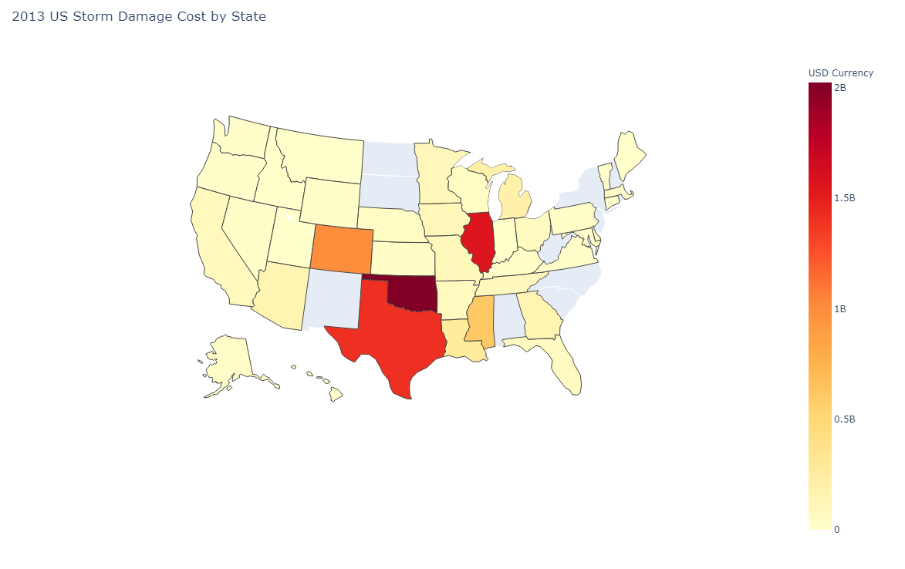
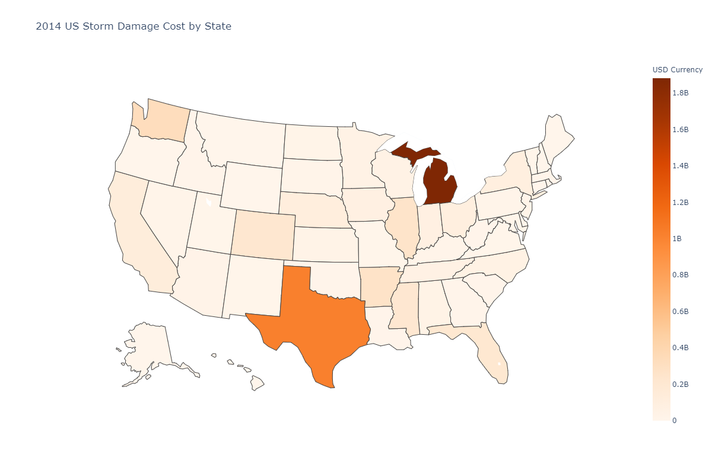
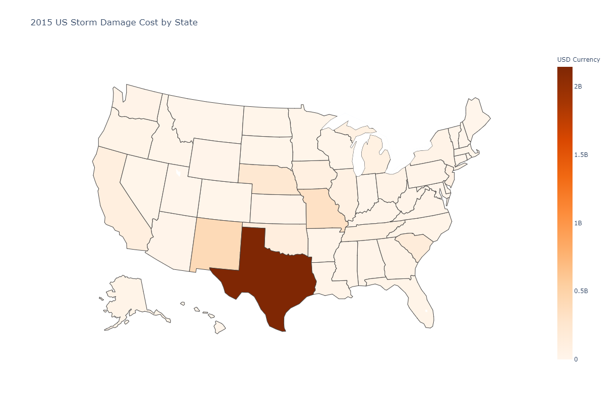
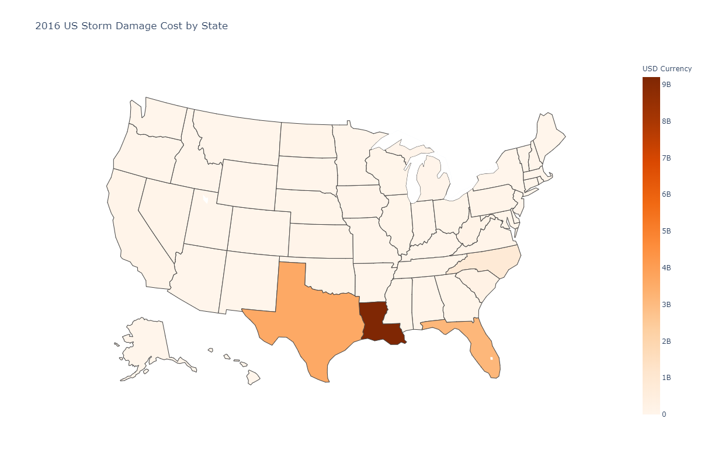
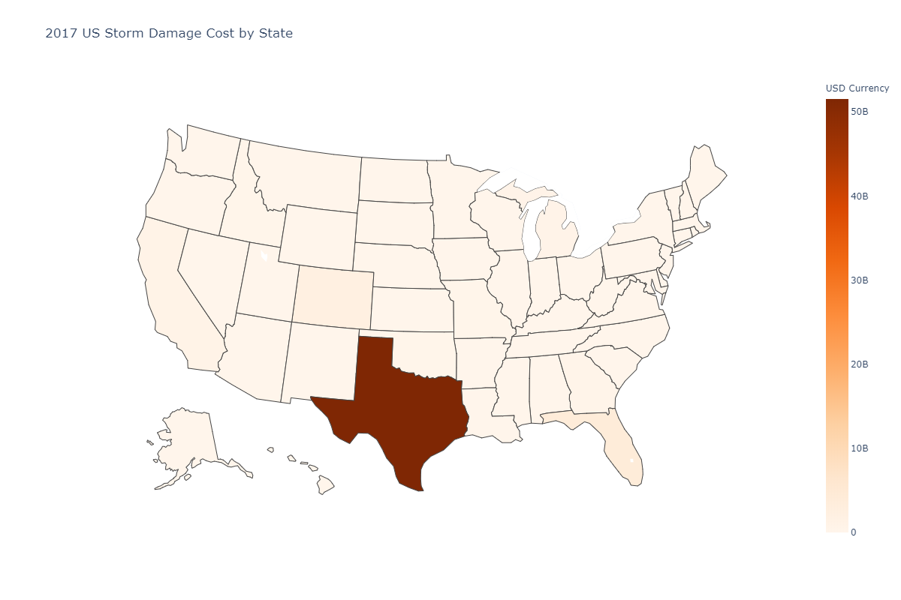

Weather damage data influences many things in our society from how much property insurance and reinsurance businesses set back for possible payouts to how the federal and local government advise people to prepare for possible disaster.

I took a look at the cost incurred by weather damage in the years 2013-2019 which excludes crop damage to see if I could find any of my own patterns. 

<a href="https://www1.ncdc.noaa.gov/pub/data/swdi/stormevents/csvfiles/">Here</a> is the link to the data I used.

<iframe width="900" height="800" frameborder="0" scrolling="no" src="//plot.ly/~Lmstephens/19.embed"></iframe>

<ul class="nav nav-tabs">
  <li><a href="#2013" data-toggle="tab">2013</a></li>
  <li><a href="#2014" data-toggle="tab">2014</a></li>
  <li><a href="#2015" data-toggle="tab">2015</a></li>
  <li><a href="#2016" data-toggle="tab">2016</a></li>
  <li><a href="#2017" data-toggle="tab">2017</a></li>
  <li><a href="#2018" data-toggle="tab">2018</a></li>
  <li><a href="#2019" data-toggle="tab">2019</a></li>
</ul>

	

		
	

	

		
	

	

		
	

	

		
	

	

		
	

	

		
	

	

		
	

